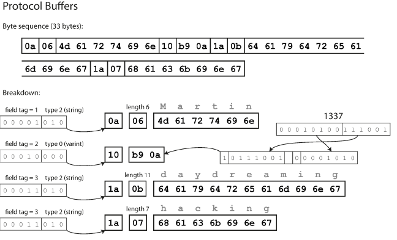
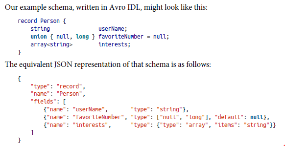
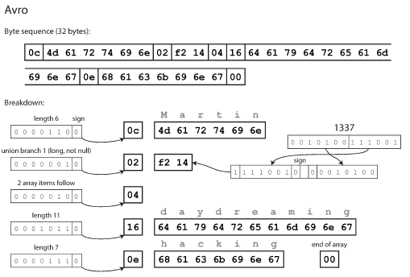

# 4. Encoding and Evolution

### Overview

- Applications change over time and features are added/removed as new products are launched. The aim is to build systems that make it easy to adapt to change.
- Changing an application in most cases triggers a need to change the data associated with it. Different data models have different ways of coping with the changes. If the data schema/model changes, the supporting application code also undergoes a change.
- Here, we will look at several formats for data encoding including JSON, XML, Proto Buffers, Thrift  and Avro.

### Formats for Encoding Data

- Two data representations -
    - **In memory** - data persisted in objects, structs, lists, hash tables, arrays, trees etc.
    - **Writing data to file or sending it over a network** needs data to be encoded into a self-contained sequence of bytes.
- We need a translation layer between two representations.
    - **Encoding/marshalling/serialization:** inmemory ⇒ byte sequence
    - **Decoding/unmarshalling/deserialization:** byte sequence ⇒ inmemory
- **Problems with language-specific encoding formats -**
    - Often tied too closely with the programming language. Both, the sender and the receiver require same language to perform serialization and deserialization.
    - To restore data in same object types, decoding process needs to be able to instantiate arbitary classes.
    - Versioning becomes difficult with these libraries.
    - They are not that efficient.
- **Standardized encodings -**
    - Can be written & read by different programming languages. JSON and XML are the most common form of standard encodings. JSON, XML, and CSV are human-readable as they are in textual format.
    - Ambiguity around encoding of numbers. (In XML and CSV we cannot distinguish between numbers and strings containing numbers. In JSON, we cannot distinguish integers and floating-point integers.
    - JSON and XML have good support of Unicode Characters but they don't support binary strings. Binary strings are usually encoded as Base64 but it increases encoding size by 33%. CSV doesn't have any schema so it's up to the application to decide which kind of schema has to be used for rows and columns.
    - Despite the above 2 flaws, JSON, XML and CSV are good enough for many purposes.
- **Binary encoding -**
    - For data used internally within the organization, there is less pressure to use an LCD encoding format. We can choose a format that is more compact or fast to parse. For a small dataset, the gains are negligible but for the larger dataset, the choice of data format has a big impact.
    - JSON is less verbose than XML, but both use lot of space as compared to binary ones which led to a fusion of binary encodings and JSON(MessagePack, BSON, UBJSON, BISON, etc.) & for XML(WBXML). For the following record, we have a MessagePack schema as follows -

        ```json
        {
        "userName": "Martin",
        "favoriteNumber": 1337,
        "interests": ["daydreaming", "hacking"]
        }
        ```

        

        Encoding data using WebPack schema produces an encoding alike above

- **Thrift and Protocol Buffers -**
    - Binary encoding libraries. Both of them need a schema for any data that is encoded.
    - To encode data in Thrift ⇒ we describe schema in **Thrift interface definition language** as ⇒

        ```c
        //Thrift schema
        struct Person {
        	1: required string userName,
        	2: optional i64 favoriteNumber,
        	3: optional list<string> interests
        }

        //Protocol Buffers schema
        message Person {
        	required string user_name = 1;
        	optional int64 favorite_number = 2;
        	repeated string interests = 3;
        }w
        ```

    - For the thrift schema above, following is the data encoding -
        - **ThriftBinary encoding -**

            

        - **ThriftCompact encoding - (34 bytes)**
            - It performs heavy compaction on ThriftBinary encoding by packing field type & tag number into a single byte using variable length integers.

            

    - For the protocol buffer schema above, following is the data encoding -

        

    - In terms of compactness ⇒ ProtocolBuffer > ThriftCompactness > ThriftBinary > Binary Encoding (Here, > denotes less space occupied by encoding)
- **Field tags and schema evolution -**
    - In short, an encoded record ⇒ Concatenation of encoded fields. **Each field is identified by its tag number and annotated by datatype**. **Field tags are critical(primary key) to the meaning of encoded data.** The name of the field can be changed in the schema, as encoded data never refers to field names. But we cannot change the field's tag, since it would make all existing encoded data invalid.
    - You can add new fields to schema with each field corresponding to a new tag number.
    - The datatype annotation allows the parser to determine how many bytes it needs to skip.
    - The annotation scheme maintains forward compatibility. Old code can read records that are written by new code. For ensuring backward compatibility; if we have a unique tag number, new code can always read old data because tag numbers still have the same meaning. **If we add a new field we cannot make it required**. If we add a new field and make it required. then the check would fail if the new code would read data written by the old code. **Thus, to ensure backward compatibility; for every new field, we either have to make them optional or default after initial deployment of schema.**
- **Datatypes and schema evolution -**
    - While changing the datatype of a field; we need to check if we are losing precision in values or the values are getting truncated.
    - Protocol buffers dont have a list/array datatype; they have a repeated marker for fields. Repeated means that same field tag appears multiple times in record.
    - When a repeated field ⇒ changes to ⇒ an optional field: New code reading old data see a list with 0/1 elements. Old code reading new data sees only the last element of the list.
- **Avro -**
    - It is a binary encoding format which uses a schema to specify structure of data being encoded. It has two langauges → Avro IDL(human-readable) and JSON based(machine-readable)

        

    - There are no tag numbers in this schema. Avro binary encodings are 32 bytes long. (Most compact until now). Following is a breakdown of encoded record in Avro -

        

    - **The binary data can only be decoded correctly if the code reading the data is using the exact same schema as the code writing the data.** This happens because to parse binary data, we go through fields in the order in which they appear in the schema and use the schema to determine datatype of each field.
    - ***Writer's schema(application wants to encode some data) and Reader's schema(application wants to decode some data) don't have to be the same; they only need to be compatible.*** During decoding, the Avro library resolves differences by looking at the writer's schema and reader's schema side by side.
    - If the code reading the data encounters a field that appears in the writer’s schema but not in the reader’s schema, it is ignored. If the code reading the data expects some field, but the writer’s schema does not contain a field of that name, it is filled in with a default value declared in the reader’s schema.
    - **Avro schema evolution rules -**
        - Forward compatability ⇒ new version of schema as writer and old version of schema as reader. And conversely is true for Backward compatability.
        - To maintain compatability, we need to add/remove field that has a default value. Without following this rule, you will break backward/forward compatability.
        - In Avro, null is not acceptable. To use null, we need to use union type. Also, there are no required/optional fields alike previous encodings.
        - Changing field datatype is possible, provided the datatype conversion is possible. **Changing field name is possible but little difficult since reader's schema can contain aliases for field names.**
        - Changing field names is backward compatible but not forward compatible. Similarly its true for adding a branch to union type.
    - What is writer's schema in perspective of Avro?
    - Large files with lots of records. - Example of Hadoop where writer's schema can be mentioned at top of large file.
    - Database with individually written records - All records of the database may not necessarily have the same schema. Include version number at beginning of every encoded record and keep a list of schema versions in the database.  A reader can fetch a record, extract the version number, and then fetch the writer’s schema for that version number from the database. Using the writer's schema, it can decode the rest of the record.
    - Sending records over n/w connection - When two processes send records over a bidirectional network, they can negotiate the schema version at the time of connection setup and then use that schema for the lifetime of the connection.
    - Dynamically generated schemes - Avro has an advantage over the others because it is friendlier to dynamically generated schemas. Also, it doesn't keep tag numbers along with the schema like Protocol Buffers and Thrift.
    
    - **Modes of data flow -**
        - Data flow through databases -
            - Here, writers encode data and readers decode it.  Backward compatability is necessary in this case.  Usually databases allow multiple reads but the writes have to be one at a time.
            - *Forward compatibility* is required in databases: If different processes are accessing the database, and one of the processes is from a newer version of the application ( say during a rolling upgrade), the newer code might write a value to the database. Forward compatibility is the ability of the process running the *old* code to be able to read the data written by the new code.
            - We also need *backward compatibility* so that code from a newer version of the app can read data written by an older version.
            - Data outlives code and often times, there's a need to migrate data to a new schema. Avro has sophisticated schema evolution rules that can allow a database to appear as if was encoded with a single schema, even though the underlying storage may contain records encoded with previous schema versions.