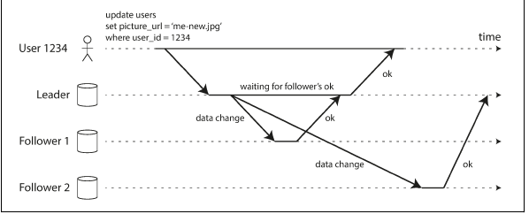
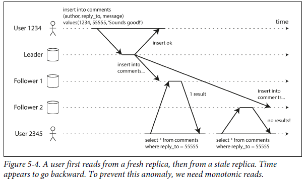
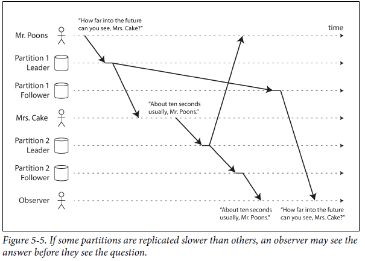
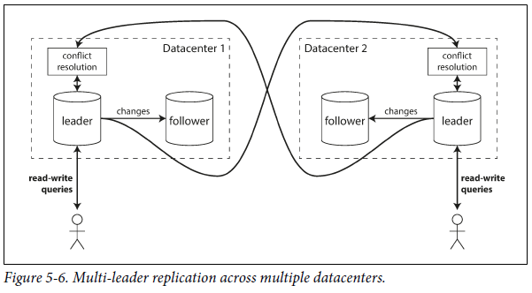
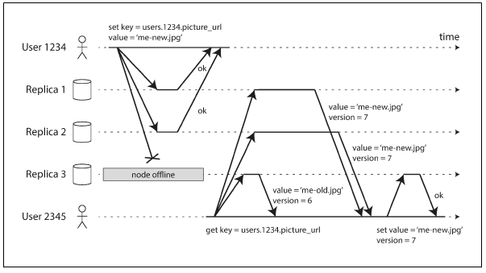

# 5. Replication

### Overview

- Replication - Keeping a copy of the same data on multiple machines connected via a network.
    - Why? - Keeping data geographically close to users(reduce latency). Allow the system to continue working even if some parts have failed(high availability).  Scale-out a number of machines that serve read queries. (increased throughput)
    - Here we assume that the database is so small that each machine can hold it. If the data that you are replicating doesn't change over time, we just have to replicate/copy data to every node once.
    - When data is changing, it becomes difficult to implement replication. There are 3 popular algorithms for replication to be looked into - single leader, multi leader, and leaderless.
    - Many trade-offs need to be considered for replication - synchronous vs asynchronous replication; how to handle failed replicas, etc.

### Leaders and Followers

- Each node stores a copy of the database called a replica. With multiple replicas, how to ensure that there is consistency between both the databases is a primary concern. Every write must be followed/processed by a replica.
- **Leader-based replication(master-slave replication) -**
    - One replica ⇒ leader.  Whenever clients want to write to the database, they send requests to the leader which first writes data to its local storage.
    - Other replicas ⇒ followers. The leader also sends the changed data to all of its followers other than writing it to its local storage. (This is called change stream/replication log) Each follower takes the log from the leader and updates its local copy of the database accordingly.
    - When the client wants to read the database it can either query the leader or any of its followers. Writes have to go through the leader.

        

    - This mode of replication is a built-in feature for most relational databases like PostgreSQL, MySQL, SQL Server, etc. It is also used in MongoDB, RethinkDB, Espresso.
    - Leader Based replication is also employed in Distributed Message Brokers like Kafka and RabbitMQ.

### Synchronous vs Asynchronous replication

- Scenario - When a user wants to update profile picture in the database. A leader with a synchronous and an asynchronous follower -

    

- The replication to follower 1 is synchronous. Leader waits until follower 1 has confirmed that it received the write before reporting success to the user.  The replication to follower 2 is asynchronous.  The leader sends a message but doesn't wait for a response from the follower.
- Normally replication is very fast and most database systems apply changes in less than a second.
- Synchronous replication guarantees that follower has an up-to-date copy of data consistent with the leader. Disadvantage is that if the follower doesn't respond back, the write cant be processed.
- **Semi-synchronous** - In general scenarios, it is impossible for all the followers to be synchronous. Even a single node outage would cause the whole system to halt. In practice ⇒ synchronous replication on a db ⇒ one of the followers is synchronous.  The above configuration guarantees that you have at least two machines that are always up to date(leader and one sync follower).
- **Often leader-based replication is configured asynchronously. The write is not guaranteed to be durable.**  However, a fully asynchronous configuration has the advantage that the leader can continue processing writes, even if all of its followers have fallen behind.
- **Weakening durability may sound like a bad trade-off, but asynchronous replication is nevertheless widely used.**

### Setting up new followers

- Setting up new followers without downtime can be done as -
    - Take a consistent snapshot of the leader's database at some point in time (if possible) without taking a lock on the entire database.
    - Copy snapshot to a new follower node.
    - **Follower connects to the leader and requests all data changes that have happened since the snapshot was taken. The snapshot has to be associated with the exact position in the leader's replication log. (log sequence numbers/ binlog coordinates)**
    - When the follower has processed a backlog of data changes since the snapshot, it means that it is on the same page as that of the leader.

### Handling node outages

- Achieving high availability with leader-based replication -
    - **Follower failure: Catch-up recovery -** On the local disk, each follower keeps a log of data changes it has received from the leader. When the follower crashes or the n/w connection between the follower and leader crashes; the follower recovers quite easily. **It knows the last transaction from the log that was processed before the fault occurred.**
    - **Leader failure: Failover -**
        - When a leader fails, another follower needs to promoted to the new leader. Clients have to be reconfigured and other followers need to start consuming data changes from the new leader. This is called failover. Failover ⇒ automatic/manually
        - Automatic failover - Determine the failed leader ⇒ Choose new leader ⇒ Reconfigure system to use new leader.
        - Things going wrong in the failover process -
            - For asynchronous systems, we may have to discard some writes if they have not been processed on a follower at the time of the leader failure. This violates clients' durability expectations.
            - Discarding writes is especially dangerous if other storage systems are coordinated with the database contents. For example, say an autoincrementing counter is used as a MySQL primary key and a redis store, if the old leader fails and some writes have not been processed, the new leader could begin using some primary keys which have already been assigned in redis. This will lead to inconsistency in the data, and it's what happened to Github ([https://github.blog/2012-09-14-github-availability-this-week/](https://github.blog/2012-09-14-github-availability-this-week/)).
            - In fault scenarios, we could have two nodes both believe that they are the leader: *split brain.* Data is likely to be lost/corrupted if both leaders accept writes and there's no process for resolving conflicts. Some systems have a mechanism to shut down one node if two leaders are detected. This mechanism needs to be designed properly though, or what happened at Github can happen again( [https://github.blog/2012-12-26-downtime-last-saturday/](https://github.blog/2012-12-26-downtime-last-saturday/))
            - It's difficult to determine the right timeout before the leader is declared dead. If it's too long, it means a longer time to recovery in the case where the leader fails. If it's too short, we can have unnecessary failovers, since a temporary load spike could cause a node's response time to increase above the timeout, or a network glitch could cause delayed packets. If the system is already struggling with high load or network problems, unnecessary failover can make the situation worse.

### Implementation of replication logs

- **Statement-based replication -**
    - *In the simplest case, the leader logs every write request that it executes and sends that statement log to its followers.* For a database, this means that every Insert, Update, and Delete is forwarded to followers and each follower parses this log and executes the SQL statement as it had received a request from the client.
    - Problems with simplest case -
        - Any statement that calls a nondeterministic function like `now()` will generate a different timestamp on the followers than the leader will generate.
        - If the statements have autoincrementing columns, or if they depend on existing data in the database, they must be executed in exactly the same order on each replica.
        - Any statements having side effects(triggers, stored procedures) may result in different side effects occurring on each replica.
- **Write-ahead log shipping -**
    - Log-structured storage:  log is the primary place for storage. Log segments are compacted and garbage-collected in the background.
    - B-Trees: Every modification is first written to a write-ahead log so that the index can be restored to a consistent state after a crash.
    - In either case, it's a log of an append-only sequence of bytes that contain all writes to the database.
    - We can build the exact same structure of data structure on the follower node by using the logs of the leader.
    - This method is used in PostgreSQL and Oracle.
    - **Disadvantage:** A WAL contains all the details of bytes modified in disk blocks thereby making replication closely coupled to the storage engine. Close coupling doesn't work well when there are new changes in the database migration or database storage formats. (Basically, leaders and followers cannot have a different version of database software)
- **Logical log replication -**
    - **Logical log -** ***Run different log formats one for replication and another for the storage engine.*** This allows the replication log to be decoupled from storage engine internals.
    - A logical log for a relational database is usually a **sequence of records describing writes to database tables at the granularity of a row -**
        - For inserted row - log contains new values of all columns.
        - For deleted row/updated row - log contains enough information to uniquely identify the row that is deleted/updated. (Usually, a primary key is an identifier)
    - Transcation that modify several rows at once generate several such log records followed by record indicating transaction was comitted. (MySQL's binlog uses this approach)
    - Logical log can be backward compatible since its decoupled from storage engine internals.
- **Trigger-based replication -**
    - **All the replication approaches afore-mentioned are implemented by database systems.** In some cases, more flexibility is needed. For example, *if there is a need to replicate only a subset of data, or if you need to replicate from one kind of database to another, or if you need conflict resolution*, **we may need to move replication up to the application layer.**
    - This can be achieved using triggers and stored procedures. Triggers register custom application code that is automatically executed when data change(write) occurs in a database system. Triggers can log these changes in a separate table, from where they can be read by an external process.
    - This method is prone to bugs and has great overheads than other replication methods.

### Problems with replication lag

- **Replication is needed for tolerating node failures, scalability, and latency**. Leader-based replication requires all writes to go through the leader whereas read-only queries can go to any replica. Read-heavy use cases can create many followers, distribute read requests across those followers. This removes read load from the leader and allows read requests to be served by nearby replicas.
- In read-scaling architectures, **the notion of creating more followers works only realistically with asynchronous applications**. If we tried to synchronously replicate to all followers, a single node failure would halt the entire system which in turn makes the leader unavailable for writing.
- **Eventual consistency** - If an application reads data from an asynchronous follower, it might see stale/outdated data when queried in parallel with the leader's data. This happens because not all writes have been reflected. If we stop writing and wait for a while, all the followers will eventually catch up and become consistent with the leader.
- **The term “eventually” is deliberately vague**: in general, there is no limit to how far a replica can fall behind. In normal operations, the delay of the write operation will be in a fraction of a second. However, for systems operating in near capacity, the delay can go up to several seconds.
- **Problems with replication lag**
    - **Reading your own writes:**
        - In a read-heavy system, we can have followers process read queries whereas writes have to be processed via a leader which then later get replicated to all the followers.
        - With asynchronous systems, if a user tries to view data immediately after a write to a leader; the writer might not be immediately reflected all of its followers. This is called the **read-after-write consistency problem.**
        - If we have a read-after-write consistency; the system ensures that when a user queries for some data; he will always be able to see the most recent data. It makes no promise about other user data.

            

        - **Challenges in implementing read-after-write consistency -**
            - To read modifications from the user, read it from the leader; otherwise; read it from the followers**.** For example - a user profile on the social network. Read the user's own profile from a leader whereas reading the other user's profile from a follower.
            - If most of the things on the user profile are editable(write-heavy), then it becomes difficult to query the leader after every edit the user has made on his profile. In such scenarios, other criteria can be used to decide for reading via a leader/follower. For example - If the user has updated/edited any field in time duration (last 60 seconds); then read it from the leader. Once the time duration elapses; read it from the followers.
            - Allow clients to remember the timestamp of their most recent write. Then the followers serving reads for that user reflect updates until at least that timestamp. If the replicas are distributed across multiple data centers; then there is additional complexity.
            - Cross-device consistency is also needed in many cases.

    - **Monotonic Reads:**
        - When reading from asynchronous followers, **it is possible for a user to see things moving backward in time. This happens when a user makes several reads from different replicas.**
        - For example - A user making the same read query twice(happens quite often when a user does a refresh). Assuming that both the queries go to different followers and if one follower has the updated data whereas the other doesn't. After refresh, the second query will not be able to retrieve data. **In effect, the second query is observing the system at an earlier point in time than the first query. This wouldn't be so bad if the first query never returned anything.**

            

        - **Monotonic reads** -  **guarantee that this kind of anomaly does not happen.** ***It’s a lesser guarantee than strong consistency, but a stronger guarantee than eventual consistency.*** When you read data, you may see an old value; monotonic reads only mean that if one user makes several reads in sequence, ***they will not see time go backward*** — i.e., they will not read older data after having previously read newer data.
    
    - **Consistent Prefix Reads:**
        - This anomaly concerns with violation of causality. If some partitions are replicated slower than others; an observer might see the answer before they see the question.

            

        - To avoid such anomaly we need **consistent prefix reads**. This guarantees that if a sequence of writes happens in a certain order and any follower reading these writes will see them in the same order. When writes are in the same order, the reads always see a consistent prefix.

### **Multi-Leader Replication**

- In a Leader-based Replication, the leader acts as a single point of failure when we are dealing with writes in the database. We can use a multi-leader approach where we allow more than one node to accept writes. In this setup, each leader simultaneously acts as a follower to other leaders.
- Use-cases -
    - **Multi datacenter operation**
        - Here, we can have multiple leaders in each datacenter. Within each datacenter, we can have a leader-follower replication. Inter-between datacenters, each datacenter's leader replicates its changes to leaders in other datacenters.

            

        - Single-leader vs Multi-leader configuration comparison in Multi datacenter operation -
            - Performance - For a single leader, every write must go over the internet to the datacenter with the leader. This adds significant latency to writes. In multi-leader, every write goes through every local datacenter and is replicated asynchronously with other datacenters. There is an inter-data center network delay (which is hidden from users).
            - Tolerance of datacenter outages - For a single leader, if the leader in the data center fails, the failover can promote another follower to become the leader. In multi-leader configuration, the system works independently of others and replicas catch up when failed datacenter comes back online.
            - Tolerance of network problems - Single leader configurations are very sensitive to problems in the inter-data center links because writes are synchronous over this link. Multi-leader configuration with asynchronous replication can tolerate network problems better.
    - Clients with offline operations - Includes applications like Calendar, Google Drive.
        - In this case, every device has a local database that acts as the leader and there is an asynchronous multi-leader application process between replicas of your calendar on all the devices.
        - From an architectural point of view, this setup is essentially the same as multi-leader replication between datacenters, taken to the extreme: each device is a “datacenter,” and the network connection between them is extremely unreliable.
    - Realtime collaborative-editing.

- **Handling Write Conflicts** - Multi-leader replication has a big disadvantage that writes conflicts can occur, which requires conflict resolution. If two users change the same record, the writes may be successfully applied to their local leader. However, when the writes are asynchronously replicated, a conflict will be detected. This does not happen in a single-leader database.
- **Synchronous versus asynchronous conflict detection** - In theory, we could make conflict detection synchronous, meaning that we wait for the write to be replicated to all replicas before telling the user that the write was successful. Doing this will make one lose the main advantage of multi-leader replication though, which is allowing each replica to accept writes independently. Use single-leader replication if you want synchronous conflict detection.
- **Conflict avoidance -** The simplest way of dealing with conflicts is to avoid them.  For example, in an application where a user can edit their own data, you can ensure that requests from a particular user are always routed to the same datacenter and use the leader in that datacenter for reading and writing.
- **Converging toward a consistent state - In multi-leader configuration there is no defined ordering of writes.** Multiple users try to write to the same field. If the field is updated to value 'X' at leader 1 and the same value is set to 'Y' at leader 2. Now when both the leaders try to asynchronously replicate the field; they observe a conflict. There is no way to determine the correctness of data in the field. The database must arrive at a convergent state which means that all the replicas must have the same final value when all changes are replicated. Ways to achieve this - Give UUID to each write/give UUID to each replica/merge values together by concatenation/record conflict explicitly using another data structure.
- **Custom Conflict Resolution Logic -**
    - The most appropriate conflict resolution method may depend on the application, and thus, multi-leader replication tools often let users write conflict resolution logic using application code. The code may be executed on read or on write:
        - *On write:* When the database detects a conflict in the log of replicated changes, it calls the conflict handler. The handler typically runs in a background process and must execute quickly. It has no user interaction.
        - *On Read:* Conflicting writes are stored. However, when the data is read, the multiple versions of the data are returned to the user, either for the user to resolve them or for automatic resolution.
    - Automatic conflict resolution is a difficult problem, but there are some research ideas being used today:
        - Conflict-free replicated datatypes (CRDTs) - are a family of data structures for sets, maps, ordered lists, counters, etc. that can be concurrently edited by multiple users, and which automatically resolve conflicts in sensible ways. Used in Riak 2.0
        - Mergeable persistent data structure - Similar to Git. Tracks history explicitly
        - Operational transformation: Algorithm behind Google Docs.
- **Multi leader replication topologies -**
    - Replication topology describes the path through which the writes are propagated to other leaders.
    - Circular topology used in MySQL forwards writes from one node to another in an incremental fashion. Star topology has a designated root that forwards writes to all other nodes. All-to-all just forwards every write from current leader to ever other leader.
    - With Circular and Star, the writes have to pass through several nodes before it reaches all the replicas. To prevent infinite loops, each node is given a unique identifier. Another problem with Circular and Star is that if just one node fails; it can interrupt the flow of replication messages between other nodes.
    - All-to-all topology is more fault tolerant than the circular and star topologies because in those topologies, one node failing can interrupt the flow of replication messages across other nodes, making them unable to communicate until the node is fixed.

### **Leaderless Replication**

- **Leaderless - Some data storage systems abandon the concept of leader and allow any replica to directly accept writes from clients.** The idea came again into existence when Amazon used it for its in-house DynamoDB database. Riak, Cassandra, and Voldemort use the same leaderless replication in their architecture.
- Here, the client can send directly its writes to several replicas or there are co-ordinator nodes that are responsible for taking in the writes. The responsibilities with the co-ordinator node are less than the leader in the sense that it doesn't enforce a particular ordering of writes.
- **Node Outage -**
    - In leader-based replication, we can resolve to failover mechanism. However, in a leaderless configuration, the failover doesn't exist.

        

    - User 1234 sends updates to all the three replicas in parallel fashion, and two available replicas accept the write but unavailable replica misses it. Lets assume (and for a reason exploring later) that if we have more than 50% of replicas acknowledging the write, we can assume that it is a legal write operation. Tn the above case, the client can simply ignore the fact that one of the replicas misses the write.
    - Now when the unavailable node comes online and if there is a read request on the same node; we will witness a stale read in form of the response. To solve this problem, the client just doesn't send a read request to one of the replicas **but to all of the replicas/several nodes in parallel**. The client will receive multiple responses with either the most up-to-date data or stale data. On the client end, we can solve the issue of choosing which read to pick forward with the help of **version numbers**.
- **Read repair and anti-entropy -**
    - How to make unavailable nodes in-sync to the new writes?
        - **Read-repair:** Reading several nodes in parallel for writes and then picking up the latest write based on versioning.
        - **Anti-entropy:** Run a background service that constantly looks for difference in data between replicas and copies any missing data from one replica to another.
- **Quorums for reading and writes -**
    - Continuing from the node outage example - If 2/3 nodes are up and 1 is not available this means at most we have one replica that is stale. Among the two that are up and running, at least one will serve up-to-date data.
    - **Quorum - For n replicas, every write must be confirmed by w nodes to be considered successful and we must query at least r nodes for each read. As long as w + r > n, we expect to get an up-to-date value when reading. Reads and writes that obey these r and w values are called quorum reads and writes. r and w are the minimum number of votes required for the read/write to be valid.**
    - n, r and w are typically configurable. A common choice is to make n - odd and to set w = r = n + 1 / 2
    - **The quorum condition allows the system to tolerate unavailable nodes.**
        - If w < n, we can process writes if node is unavailable.
        - If r < n, we can prcoess reads if node is unavailable.
        - With n = 3, r = w = 2, we can tolerate one unavailable node.
        - With n = 5, r = w = 3, we can tolerate two unavailable nodes.
        - Reads and writes are always sent to all n replicas in parallel. The parameters w and r determine how many nodes we wait for—i.e., how many of the n nodes need to report success before we consider the read or write to be successful.
    - Limitations -
        - If you have n replicas, and you choose w and r such that w + r > n, you can generally expect every read to return the most recent value written for a key. This means that among the nodes we read, there must be at least one node that must return the latest value. Often r and w are chosen more than n/2 nodes, it ensures w + r > n and also tolerates up to n/2 node failures.
        - With a smaller w and r, you are more likely to read stale values, because it’s more likely that your read didn’t include the node with the latest value. However, this guarantees low latency and high availability.
        - When w + r > n , there are edge cases in which you will receive stale values -
            - Sloppy quorum is used - The writes end up on nodes different that the r reads. Thus, there is no guarantee between an overlap between r and w nodes.
            - When two writes occur concurrently, merging the write conflicts is the best and safe solution.
            - When a write and read occur concurrently; the write may be reflected on only some of the replicas. Here we are unsure if the read returns old/new value.
            - If a write succeeded on some replicas but failed on others (for example because the disks on some nodes are full), and overall succeeded on fewer than w replicas, it is not rolled back on the replicas where it succeeded.
            - If a node carrying a new value fails, and its data is restored from a replica carrying an old value, the number of replicas storing the new value may fall below w,
            breaking the quorum condition.
- **Monitoring Staleness -**
    - It's important to monitor whether databases are returning up-to-date results, even if the application can tolerate stale reads. If a replica falls behind significantly, the database should alert you so that you can investigate the cause.
    - For leader-based replication, databases expose metrics for the replication lag. It's possible to do this because writes are applied to the leader and followers in the same order. We can determine how far behind a follower has fallen from a leader by subtracting its position from the leader's current position.
    - This is more difficult in leaderless replication systems as there is no fixed order in which writes are applied. There's some research into this, but it's not common practice yet.
- **Sloppy Quorum and Hinted-handoffs -**
    - Databases that have configured the quorums correctly can tolerate the failure of individual nodes without the need for failover. **They can also tolerate individual nodes going slow because requests don't have to wait for all the n nodes to respond. They can respond when w or r nodes have responded.** This configuration makes databases with leaderless replication suitable for use cases that need high availability, low latency, and that can tolerate stale reads occasionally.
    - However, quorums, as described above, are not as fault-tolerant as they can be. A simple network interruption can cut off all the nodes of the database from the client. In such a case, it is likely that fewer than w or r reachable nodes remain; thus it is not possible to achieve a quorum.
    - In a cluster with more than n nodes, the client can connect to some of the database nodes during a network interruption(not the nodes that need to assemble a quorum for a particular value). In this case, the database designers face a trade-off -
        - Is it better to return errors to all requests for which we cannot reach a quorum of
        w or r nodes?
        - Or should we accept writes anyway, and write them to some nodes that are
        reachable but aren’t among the n nodes on which the value usually lives?  **⇒ Sloppy Quorum ⇒** Writes and reads still need w and r successful responses, but they might not include nodes that aren't among the designated n "home" nodes)
    - By analogy, if you lock yourself out of your house, you may knock on the neighbor’s door and ask whether you may stay on their couch temporarily.
    - Once the network interruption is fixed, and writes that one node temporarily
    accepted on behalf of another node are sent to the appropriate “home” nodes. **⇒ Hinted Handoffs**
    - Sloppy quorums ⇒ increase write availability. As long as w nodes are available, the database accepts writes. Even when w + r > n, we can't be sure to read the latest value for key because the latest value may have been temporarily written to some nodes outside of n
    - **Thus, sloppy quorum ≠ quorum. It is only an assurance of durability.**